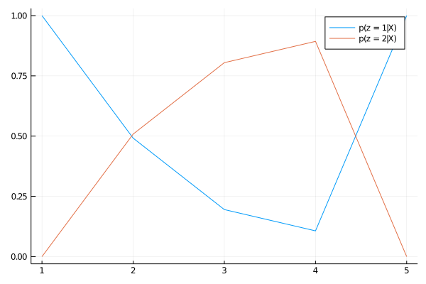

# Inference

```@meta
CurrentModule = MarkovModels
```

## Baum-Welch algoritm (forward-backward)

The Baum-Welch algorithm computes the probability to be in a state `i`
at time $n$:
```math
p(z_n = i | x_1, ..., x_N)
```
It is implemented by the [`αβrecursion`](@ref) and the [`resps`](@ref)
functions.

```@docs
αβrecursion
resps
```

### Example

First, we create the inference FSM:
```julia
using MarkovModels

emissionsmap = Dict(
    "a" => 1,
    "b" => 2,
    "c" => 1
)

fsm = LinearFSM(["a", "b", "c"], emissionsmap)
for state in states(fsm)
    (isinit(state) || isfinal(state)) && continue
    link!(state, state)
end
fsm = fsm |> weightnormalize
```


Note that state "a" and "c" share the same emission pdf.

As we don't have real distributions/data we simply simulate some
fake per-pdf and per-frame log-likelihood:
```julia
D, N = 2, 5 # number of pdfs, number of frames
llh = randn(D, N)
```

Finally, we run the Baum-Welch algorithm:
```julia
lnαβ, ttl = αβrecursion(fsm, llh)
γ = resps(fsm, lnαβ)

using Plots
p = plot()
plot!(p, γ[1], label = "p(z = 1|X)")
plot!(p, γ[2], label = "p(z = 2|X)")
plot!(p, γ[3], label = "p(z = 3|X)")
```



##  Getting the label sequences

To generate a label sequence from some data, you can either:
  * compute the most likely sequence of labels (see [`beststring`](@ref))
  * draw a random sequence of label from $p(W|x_1, ..., x_N)$ where $W$
    is a sequence of labels of any length (see [`samplestring`](@ref))

```@docs
beststring
samplestring
```

## Pruning

The inference functions ([`αβrecursion`](@ref), [`beststring`](@ref)
and [`samplestring`](@ref)) can be performed with a *pruning strategy*.
This is necessary when the inference FSM is huge potentially leading to
very long computational time. We propose two default strategies:

```@docs
SafePruning
ThresholdPruning
```
!!! warning

    [`ThresholdPruning`](@ref) is not *safe* in the sense that it does
    not guarantee that, after pruning, a valid path will remain. You
    can build a safe threshold-based pruning by combining (in the given
    order) the two strategies:
    ```julia
    ThresholdPruning(100) ∘ SafePruning(fsm)
    ```
